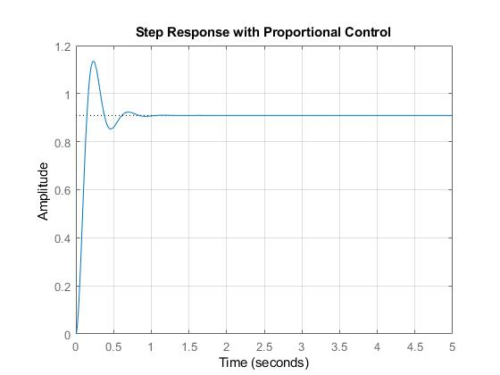
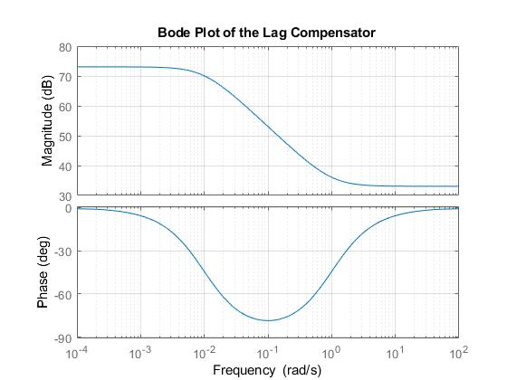
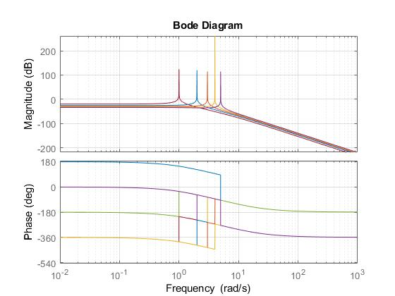
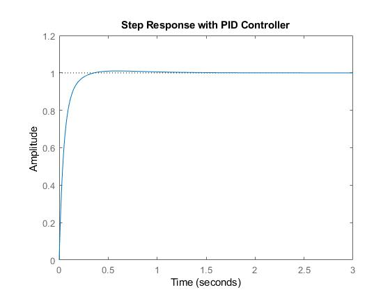
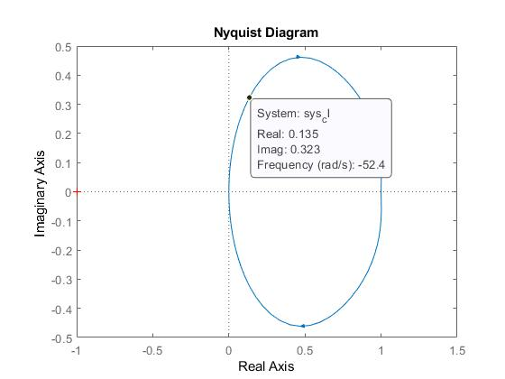

# DC Motor Velocity Control
DC-Motor poles and zeros, stablity, step response, impulse response, bode plot, magnitude margin, phase margin, root locus, pid controller, nyquiest diagram analysis with given open loop transform function.

..

All available /img and explained in /doc/Report pdf files.

* Any Question? 
Feel free to feedback amh.morteza@gmail.com
